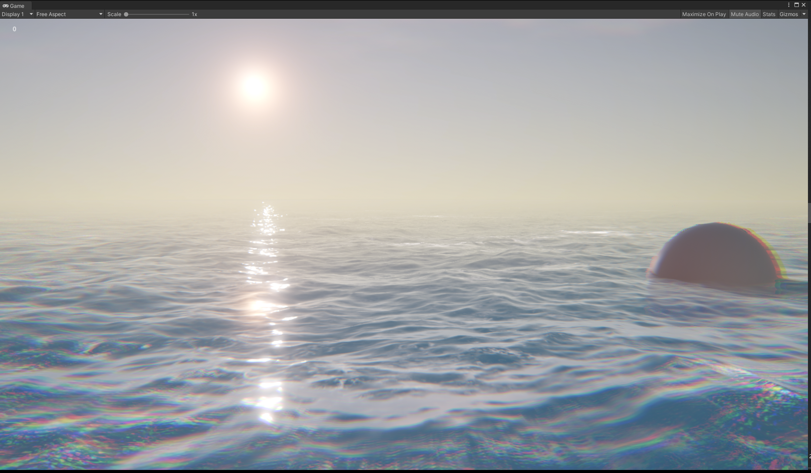
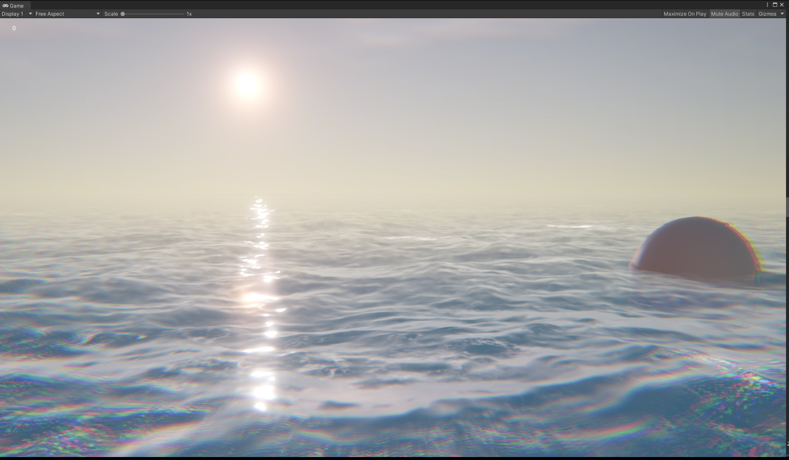
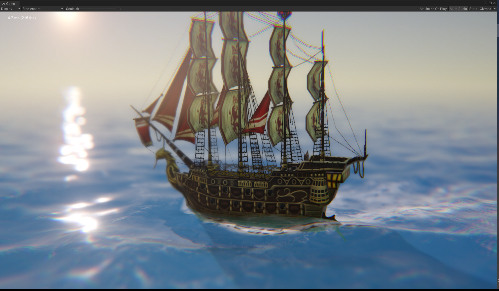
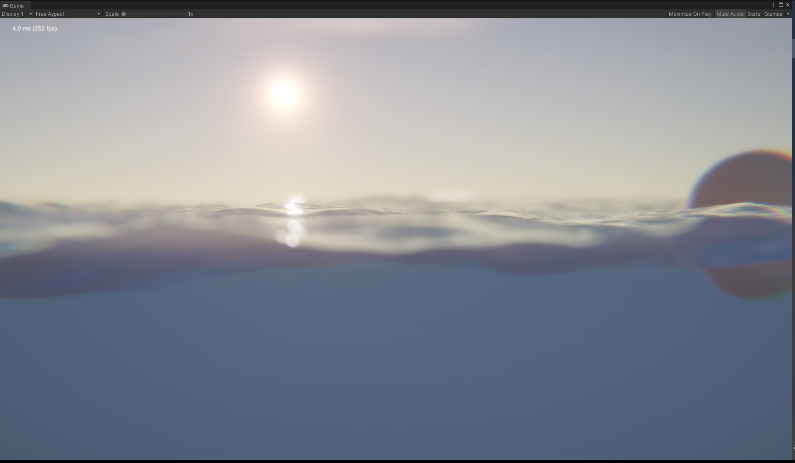

# URPOceanTessellation

Require Unity 2020.3.18f1 or later

Compare to URPOcean project(https://github.com/bearworks/URPOcean),
This project use full FFT methods to build more wave effects with Tessellation shader, BUT also it need more hardware features(#pragma target 4.6 at least) and 
Unity recently APIs support, include MRT3(ARGBHalf RenderTexture), TextureFormat ARGBHalf, RGBA64 and AsyncGPUReadback.

Tess Factor 6

Tess Factor 1

Sailing

Underwater with DOF

